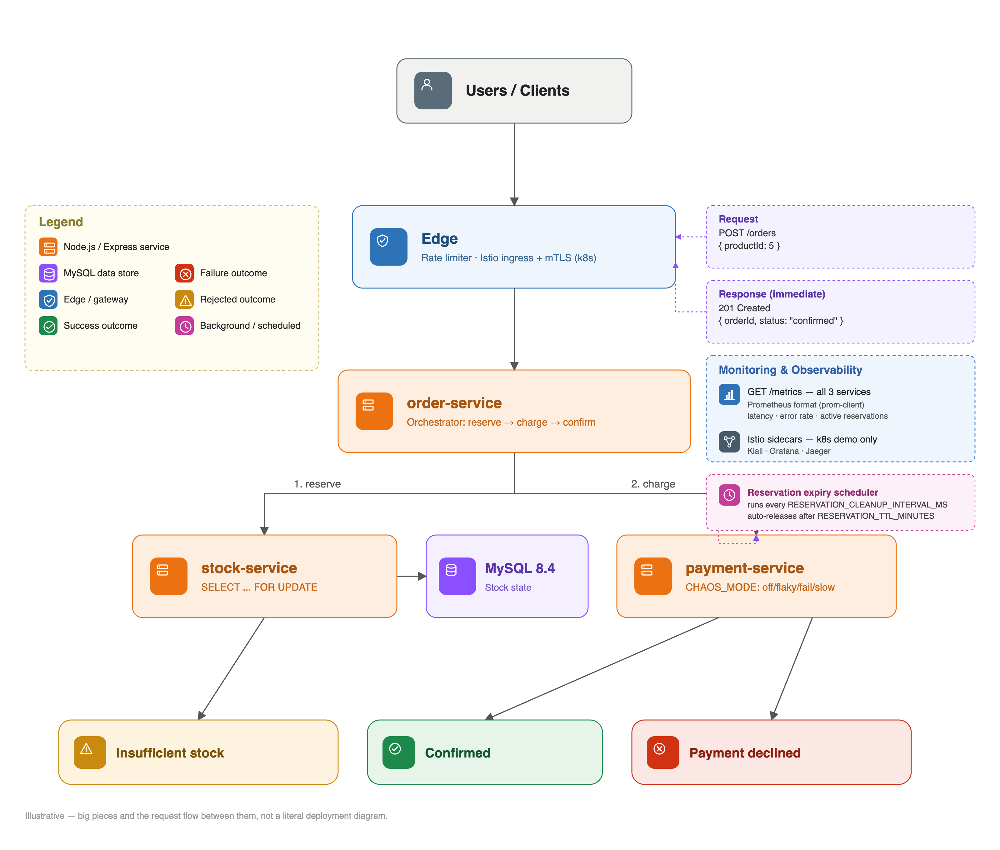

# stock-reservation-service


A stock reservation system built as three services, to demonstrate the two things that matter once you cross from "one API" to "microservices": correct concurrency handling inside a service, and correct traffic behavior *between* services.

- **[stock-service](services/stock-service/)** — the core: reserve/sell/return inventory with `SELECT ... FOR UPDATE` transactions, so concurrent requests on the same product can't oversell it. TypeScript, Express, MySQL. See its own [README](services/stock-service/README.md) for the full API reference.
- **order-service** — orchestrates an order: reserve stock → charge payment → confirm the sale (or release the reservation if payment fails). A minimal in-memory stub — it exists to be a realistic synchronous caller, not a production order system.
- **payment-service** — a fake payment authorizer with a `CHAOS_MODE` toggle (`off` / `flaky` / `fail` / `slow`) for exercising failure handling on demand. Also a minimal in-memory stub.

The three talk to each other over real HTTP, which is what makes the [Kubernetes + Istio service mesh demo](docs/mesh.md) meaningful: mTLS, retries/timeouts, canary releases, and circuit breaking only do something once there's inter-service traffic for them to act on.

## Architecture



The big pieces and how a request flows through them — not a literal deployment diagram (see [docs/mmd](docs/mmd) for that, and [docs/mesh.md](docs/mesh.md) for the Kubernetes + Istio topology in full).

## Running it

**Just the API, for local development** (no mesh, no Kubernetes):
```bash
docker compose up -d --build
curl http://localhost:3000/health   # stock-service
curl http://localhost:3001/health   # order-service
curl http://localhost:3002/health   # payment-service

curl -X POST http://localhost:3001/orders \
  -H "Content-Type: application/json" -d '{"productId":1}'
```
See [services/stock-service/README.md](services/stock-service/README.md) for the full stock-service API, environment variables, and test suite.

To verify the whole stack end to end (not just stock-service in isolation) — happy path, payment decline releasing the reservation, insufficient stock, and concurrent orders never overselling, all driven over real HTTP through order-service:
```bash
scripts/integration-test.sh
```

**The full Kubernetes + Istio mesh demo** — mTLS, retry/timeout policies, a 90/10 canary release, circuit breaking, and Kiali/Grafana observability, all running on a local [kind](https://kind.sigs.k8s.io/) cluster:
```bash
scripts/mesh/kind-up.sh
scripts/mesh/build-and-load.sh
scripts/mesh/deploy.sh
scripts/mesh/demo-canary.sh
```
Full walkthrough, one section per capability with the exact YAML responsible and the command to see it live: **[docs/mesh.md](docs/mesh.md)**.

## Repository structure

```
stock-reservation-service/
├── services/
│   ├── stock-service/     # the core inventory API (see its own README)
│   ├── order-service/     # order orchestration stub
│   └── payment-service/   # fake payment authorizer stub
├── deploy/
│   ├── k8s/                # namespace, MySQL, and Deployments/Services for all three
│   └── istio/               # PeerAuthentication, DestinationRules, VirtualServices, Gateway
├── scripts/
│   ├── mesh/                 # kind/Istio automation — cluster up, build, deploy, and demo scripts
│   └── integration-test.sh   # whole-stack HTTP integration test (docker compose)
├── docs/                    # architecture diagrams + the mesh demo walkthrough
└── docker-compose.yml       # all three services + MySQL, for local dev without Kubernetes
```

## CI

GitHub Actions ([.github/workflows/ci.yml](.github/workflows/ci.yml)) runs on every push/PR to `main`, in two jobs:

1. **test** — lints, typechecks, and unit-tests `stock-service` (100% coverage), then runs its e2e suite against real MySQL.
2. **docker** — builds and starts all three services + MySQL via `docker compose`, then runs [`scripts/integration-test.sh`](scripts/integration-test.sh) against the live stack: happy path, payment decline releasing the reservation, insufficient stock, and concurrent orders never overselling — all driven over real HTTP through `order-service`.

The Kubernetes/Istio mesh demo is intentionally not part of CI — it's a local demo environment (see [docs/mesh.md](docs/mesh.md)'s [Scope and honesty](docs/mesh.md#scope-and-honesty) section), not a deployed system.
