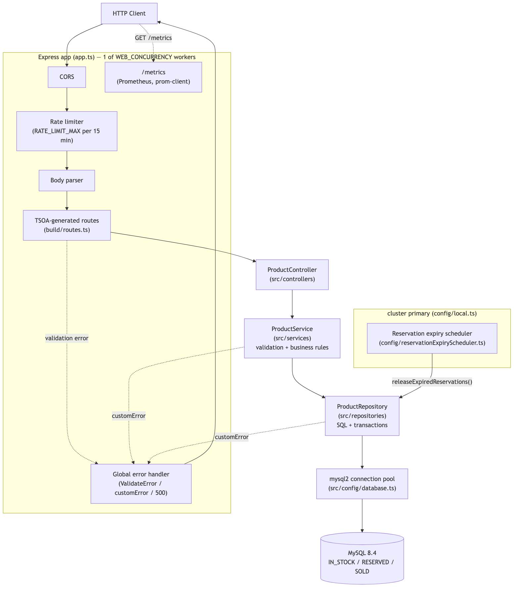

# stock-service

  

Inventory API: reserve, sell, return, and delete stock. Every write runs inside a `SELECT ... FOR UPDATE` transaction, so concurrent requests on the same product can't oversell it. TypeScript, Express, MySQL.

One of three services in [stock-reservation-service](../../README.md) — see the root README for the whole-system picture, including the Kubernetes + Istio service mesh demo.

## Tech Stack

- **Runtime**: Node.js 24, TypeScript
- **Framework**: Express.js
- **Database**: MySQL 8.4 — connection pool, atomic transactions with `SELECT FOR UPDATE`
- **Driver**: mysql2 with prepared statements (SQL injection safe)
- **Documentation**: TSOA + Swagger UI (auto-generated)
- **Metrics**: Prometheus (`prom-client`)
- **Tests**: Jest, ts-jest — unit + e2e with real MySQL via Docker
- **Quality**: ESLint, Prettier
- **Container**: Docker + Docker Compose

## Architecture

Three layers, no more:

- **Controller** (`src/controllers`) — TSOA-decorated HTTP handlers, thin pass-through to the service.
- **Service** (`src/services`) — input validation and business rules.
- **Repository** (`src/repositories`) — SQL queries and transactions against MySQL via `mysql2`.



Diagram sources and more: [docs/mmd](../../docs/mmd) — [business flow](../../docs/img/business-flow.png), [database schema](../../docs/img/db-schema.png), [deployment](../../docs/img/deployment.png).

## Prerequisites

- Node.js >= 24
- npm >= 8
- Docker + Docker Compose

## Setup

```bash
git clone https://github.com/luizcurti/stock-reservation-service.git
cd stock-reservation-service/services/stock-service
npm install
cp .env.example .env   # defaults work for local development

# From the repo root, start the database
docker compose up -d mysql_database

# Development (hot reload)
npm run dev

# or production
npm run build && npm start
```

API available at `http://localhost:3000`.

## Environment Variables

See [.env.example](.env.example) for the full list with defaults — only variables the app actually reads are defined.

| Variable | Description | Default |
|----------|-------------|---------|
| `DB_HOST` | MySQL host | `localhost` |
| `DB_PORT` | MySQL port | `3306` |
| `DB_NAME` | Database name | `stock` |
| `DB_USER` | Database user | `app_user` |
| `DB_PASSWORD` | Database password | — |
| `NODE_ENV` | `development` \| `production` | `development` |
| `PORT` | HTTP port | `3000` |
| `ALLOWED_ORIGINS` | Comma-separated CORS origins. Outside production, defaults to `*` when unset; in production, defaults to denying all origins when unset | — |
| `RATE_LIMIT_MAX` | Max requests per IP per 15-minute window | `100` |
| `SERVICE_VERSION` | Echoed back as the `X-Version` response header — used by the [Istio canary demo](../../docs/mesh.md#canary-release) to tell v1/v2 apart | `v1` |
| `WEB_CONCURRENCY` | Worker processes forked via Node's `cluster` module, so one container uses multiple CPU cores. Set to `1` where scaling happens via k8s replicas instead | `min(CPU count, 4)` |
| `RESERVATION_TTL_MINUTES` | How long a reservation is held before it's eligible for automatic release (see [Reservation expiry](#reservation-expiry)). Accepts fractional values for testing | `30` |
| `RESERVATION_CLEANUP_INTERVAL_MS` | How often the app checks for and releases expired reservations | `300000` (5 min) |

## API Reference

Interactive docs at `http://localhost:3000/docs` (requires build). A ready-to-use Insomnia collection is included at `Insomnia.json`.

### Endpoints

| Method | Path | Description |
|--------|------|-------------|
| `PATCH` | `/product/:id/stock` | Create or update stock for a product |
| `GET` | `/product/:id` | Get stock summary (available, reserved, sold) |
| `POST` | `/product/:id/reserve` | Reserve 1 unit — returns a UUID token |
| `POST` | `/product/:id/sold` | Confirm sale using reservation token |
| `POST` | `/product/:id/return` | Return reserved unit back to stock |
| `DELETE` | `/product/:id` | Delete product (only if no reservations or sales history) |
| `GET` | `/health` | Health check |
| `GET` | `/metrics` | Prometheus metrics |

### Request / Response examples

#### Create or update stock
```http
PATCH /product/5/stock
Content-Type: application/json

{ "product": "Volleyball", "qtd": 50 }
```
```json
{ "id": 5, "product": "Volleyball", "stock": 50 }
```

#### Get stock summary
```http
GET /product/5
```
```json
{ "ID": 5, "IN_STOCK": 49, "RESERVE": 1, "SOLD": 3 }
```

#### Reserve a unit
```http
POST /product/5/reserve
```
```json
{ "id": 5, "product": "Volleyball", "reservationToken": "550e8400-e29b-41d4-a716-446655440000" }
```

#### Confirm sale
```http
POST /product/5/sold
Content-Type: application/json

{ "reservationToken": "550e8400-e29b-41d4-a716-446655440000" }
```

#### Return reservation to stock
```http
POST /product/5/return
Content-Type: application/json

{ "reservationToken": "550e8400-e29b-41d4-a716-446655440000" }
```

#### Delete product
```http
DELETE /product/5
```
Returns `204 No Content` on success. Returns `409 Conflict` if active reservations or sales history exist.

### Error responses

| Status | Meaning |
|--------|---------|
| `400` | Validation error (invalid ID, empty product name, invalid UUID token) |
| `404` | Product or reservation not found |
| `409` | Conflict — cannot delete product with reservations or sales history |
| `422` | Missing required body fields (validated by TSOA) |
| `500` | Internal server error |

## Business Flow

```
 PATCH /stock  →  POST /reserve  →  POST /sold
                        ↓
                 POST /return
```

1. **Create/update stock** — `PATCH /product/:id/stock`
2. **Reserve** — decrements `IN_STOCK` by 1, records token in `RESERVED`
3. **Finalize**:
   - **Sold** — moves token from `RESERVED` to `SOLD` (stock stays decremented)
   - **Return** — removes token from `RESERVED`, increments `IN_STOCK` back
4. **Delete** — removes the product from `IN_STOCK` only when no active reservations or sales history exist

All reserve/return/sell/delete operations use database transactions with `SELECT FOR UPDATE` to prevent race conditions.

### Reservation expiry

A reservation not sold or returned within `RESERVATION_TTL_MINUTES` (default 30 min) is released back to stock automatically — e.g. the caller reserved stock and then failed before confirming the sale. `startReservationExpiryScheduler` (`src/config/reservationExpiryScheduler.ts`) runs on a timer (`RESERVATION_CLEANUP_INTERVAL_MS`) and releases each expired reservation through the same `FOR UPDATE` transaction `POST /return` uses.

## Metrics

`GET /metrics` exposes Prometheus-format metrics: default Node process metrics (CPU, memory, event loop lag), `http_request_duration_seconds` by route/method/status, `reservations_active` (queried live from the database), `rate_limit_rejections_total`, and `reservations_released_total`.

## Validation Rules

- `id` must be a positive integer
- `product` must be a non-empty string, max 100 characters
- `qtd` must be a non-negative integer
- `reservationToken` must be a valid **UUID v4** string

## Testing

The e2e suite runs the real Express app (in-process, via supertest) against a real MySQL instance, so it covers both HTTP/API behavior and cross-layer integration — no separate "integration test" tier.

```bash
npm test               # unit tests — mock the repository/database layer
npm run test:e2e       # e2e/API tests against real MySQL (Docker)
npm run test:coverage  # unit tests with coverage report
```

Coverage: **100%** statements / branches / functions / lines.

## Scripts

```bash
npm run dev            # Development with hot reload
npm run build          # Lint + generate TSOA routes/spec + compile TypeScript
npm start              # Start in production mode (requires build first)
npm test               # Run unit tests
npm run test:e2e       # Run e2e/API tests against real MySQL (Docker)
npm run test:coverage  # Run unit tests with coverage report
npm run lint           # ESLint + auto-fix
npm run lint:check     # ESLint check only (used in CI)
npm run format         # Prettier format
npm run format:check   # Prettier check only (used in CI)
npm run typecheck      # tsc --noEmit (run `npm run build` first — app.ts imports the generated ./build/routes)
npm run clean          # Remove build/ and coverage/
```

## Project Structure

```
services/stock-service/
├── src/
│   ├── config/          # DB pool, metrics, scheduler, env-driven config, Lambda/local entry points
│   ├── controllers/     # Express route handlers (TSOA)
│   ├── services/        # Business logic + input validation
│   ├── repositories/    # SQL queries + transactions
│   ├── models/          # TypeScript interfaces
│   └── customErrors/    # Custom error class
├── tests/
│   ├── *.spec.ts        # Unit tests
│   └── e2e/             # End-to-end / API tests
├── SQL/
│   └── stock.sql     # Database schema (manual reference / seed data)
├── Dockerfile         # Multi-stage build for the app image
├── build/             # Compiled output (generated; mirrors src/ + app.ts)
└── Insomnia.json      # API collection
```

`docs/` (Mermaid sources + rendered diagrams) and `docker-compose.yml` (app + MySQL services) live at the repo root — see the [root README](../../README.md).

## Database Schema

```sql
CREATE TABLE `IN_STOCK` (
  `id`         int NOT NULL PRIMARY KEY,
  `product`    varchar(100) NOT NULL,
  `qtd`        int NOT NULL DEFAULT 0,
  `created_at` timestamp DEFAULT CURRENT_TIMESTAMP,
  `updated_at` timestamp DEFAULT CURRENT_TIMESTAMP ON UPDATE CURRENT_TIMESTAMP
);

CREATE TABLE `RESERVED` (
  `id`               int NOT NULL AUTO_INCREMENT PRIMARY KEY,
  `id_stock`         int NOT NULL,
  `product`          varchar(100) NOT NULL,
  `reservationToken` varchar(100) NOT NULL UNIQUE,
  `created_at`       timestamp DEFAULT CURRENT_TIMESTAMP,
  `expires_at`       timestamp DEFAULT (DATE_ADD(CURRENT_TIMESTAMP, INTERVAL 24 HOUR)),
  FOREIGN KEY (`id_stock`) REFERENCES `IN_STOCK`(`id`) ON DELETE CASCADE
);

CREATE TABLE `SOLD` (
  `id`               int NOT NULL AUTO_INCREMENT PRIMARY KEY,
  `id_stock`         int NOT NULL,
  `product`          varchar(100) NOT NULL,
  `reservationToken` varchar(100) NOT NULL UNIQUE,
  `sold_at`          timestamp DEFAULT CURRENT_TIMESTAMP,
  FOREIGN KEY (`id_stock`) REFERENCES `IN_STOCK`(`id`)
);
```

## Docker

The root [docker-compose.yml](../../docker-compose.yml) defines `mysql_database` (MySQL 8.4) and `app` (built from this service's [Dockerfile](Dockerfile)), alongside `order-service` and `payment-service` — see the [root README](../../README.md) for the whole stack.

```bash
# From the repo root: build and start the full stack (all services + MySQL)
docker compose up -d --build

curl http://localhost:3000/health

# Stop and remove containers (add -v to also drop the MySQL volume)
docker compose down
```

To run only the database (e.g. for local `npm run dev` against a containerized MySQL):
```bash
docker compose up -d mysql_database
```

The `app` service reads its database connection from `DB_HOST=mysql_database` (the Compose service name) and otherwise uses the same environment variables as [.env.example](.env.example), overridable via a `.env` file in the repo root.

## CI

GitHub Actions ([.github/workflows/ci.yml](../../.github/workflows/ci.yml)) runs on every push/PR to `main`: install, audit, format check, lint, typecheck, unit tests with coverage, build, e2e tests against real MySQL, then a whole-stack integration test ([`scripts/integration-test.sh`](../../scripts/integration-test.sh)) with all three services + MySQL over real HTTP.

## Troubleshooting

**MySQL connection errors**
```bash
docker compose ps                     # Check container status
docker compose down && docker compose up -d mysql_database  # Restart
```

**Build errors**
```bash
npm run clean && npm run build
```

**Reinstall dependencies**
```bash
rm -rf node_modules && npm ci   # package-lock.json is committed — keep it
```
